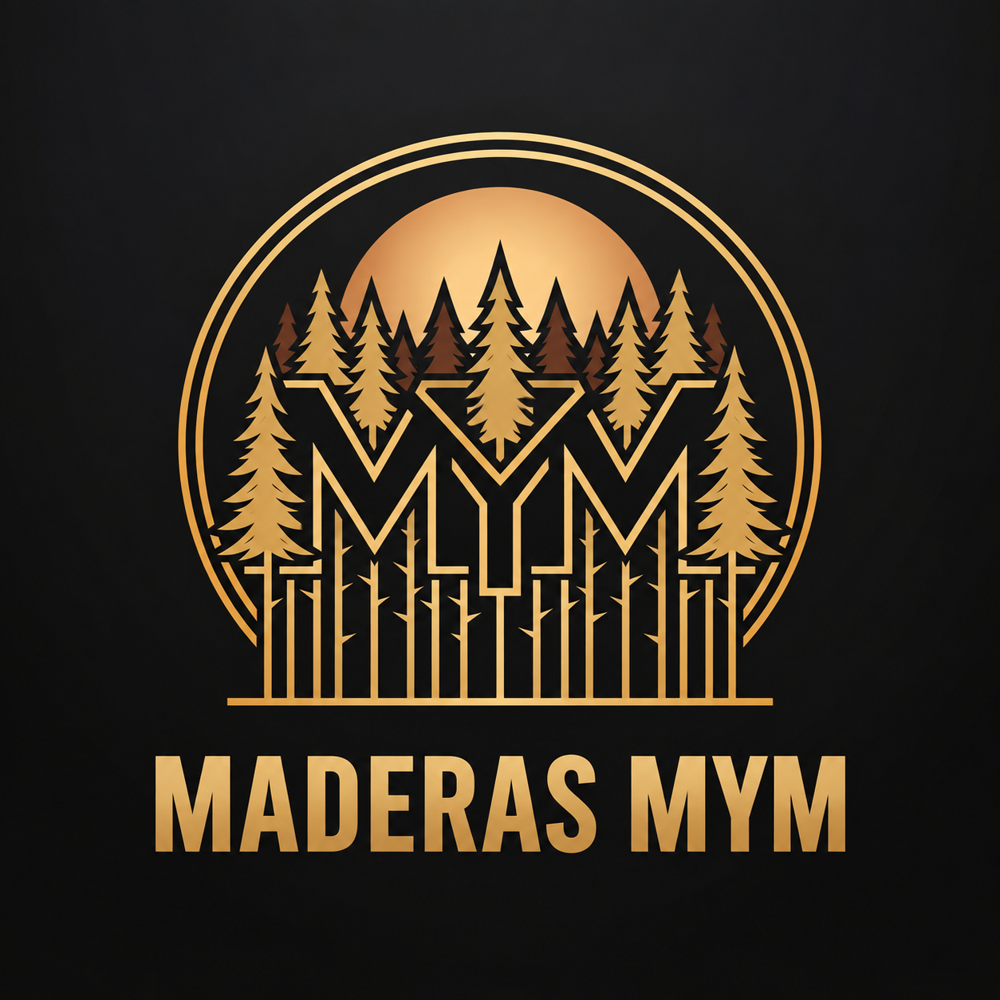

<div align="center">



# Maderas M&M

### Sitio web corporativo para un aserradero chileno 🌲

**Catálogo · Cotización · Asistente IA · Atención directa**

[](https://react.dev/)
[](https://vite.dev/)
[](https://tailwindcss.com/)
[](https://supabase.com/)
[](https://vercel.com/)

[Ver sitio web](https://web-maderas-mm.vercel.app)

</div>

---

## Sobre el proyecto

Sitio web desarrollado para **Maderas M&M**, enfocado en presentar sus productos de madera de forma clara, facilitar cotizaciones y acercar la atención del aserradero a clientes desde celular o computador.

La experiencia combina una identidad visual cálida con herramientas útiles para un negocio real: catálogo, comparación de terminaciones, contacto directo y asistencia mediante IA.

## Funcionalidades

- 🌲 Catálogo de maderas, terminaciones y productos disponibles
- ↔️ Comparador interactivo entre pino bruto y pino cepillado
- 📐 Información de medidas y trabajos a pedido
- 💬 Cotización y contacto directo por WhatsApp
- 🤖 Asistente IA especializado en los productos de Maderas M&M
- 🖼️ Consulta mediante fotografías en el asistente
- 🔐 Panel interno para seguimiento de conversaciones
- 📱 Diseño responsive para móvil, tablet y escritorio

## Productos representados

| Producto | Información principal |
| --- | --- |
| Pino Bruto | Madera aserrada para construcción y estructuras |
| Pino Cepillado | Terminación C4C lisa y uniforme |
| Pino Dimensionado | Largos disponibles y medidas consultables |
| Pilares y Vigas | Fabricación a medida |
| Cantonera | Terminación natural y rústica |
| Tablones Rústicos | Piezas únicas para mesones, muebles y quinchos |
| Rejas Trillage | Panel estándar 1 × 2 m y otras medidas a pedido |

## Stack

```text
Frontend       React + Vite
Estilos        Tailwind CSS
Base de datos  Supabase
IA             Asistente especializado
Iconografía    Lucide React
Deploy         Vercel
```

## Estructura

```text
Web-maderas-mm/
├── api/                  # Funciones de servidor
├── public/
│   └── assets/           # Fotografías, branding y recursos visuales
├── src/
│   ├── components/       # Componentes principales de interfaz
│   ├── hooks/            # Hooks reutilizables
│   ├── lib/              # Servicios y utilidades
│   ├── pages/            # Páginas de la aplicación
│   ├── App.jsx
│   ├── index.css
│   └── main.jsx
├── package.json
├── tailwind.config.js
├── vercel.json
└── vite.config.js
```

## Desarrollo local

Requiere Node.js y npm.

```bash
git clone https://github.com/mirandagyelyag-lang/Web-maderas-mm.git
cd Web-maderas-mm
npm install
npm run dev
```

Para comprobar la versión de producción:

```bash
npm run build
npm run preview
```

## Scripts

| Comando | Uso |
| --- | --- |
| `npm run dev` | Inicia Vite en desarrollo |
| `npm run build` | Genera el build de producción |
| `npm run preview` | Previsualiza el build |
| `npm run lint` | Revisa el código con ESLint |
| `npm run lint:fix` | Corrige problemas compatibles con ESLint |
| `npm run typecheck` | Ejecuta la comprobación configurada en JSConfig |

---

<div align="center">

**Maderas M&M · Forjamos el futuro en madera**

Proyecto web desarrollado para una empresa real en Chile.

</div>
